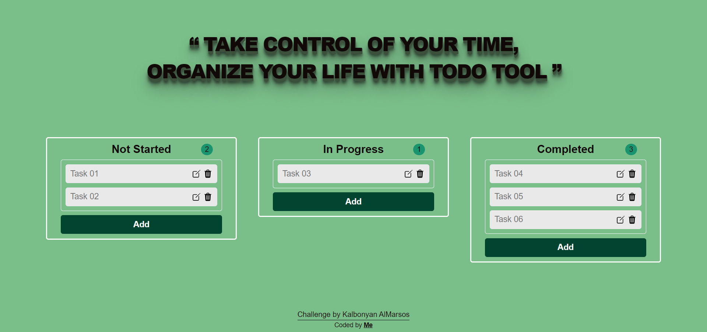

# ToDoZone Project

## What is ToDoZone ?
ToDoZone app which using HTML, CSS, and JavaScript is a simple and user-friendly tool for keeping track of tasks and managing your daily schedule. The app has a clean and intuitive interface that allows you to quickly add new tasks, drag them if complete, and delete them when you're finished.

### ToDoZone Screenshot

[Live Preview Link](https://mytodoapp-hsnmu.netlify.app/)

## Technologies in ToDoZone :
- HTML
- CSS [Flex Box] 
- JavaScript [DOM, Drag & Drop Events, LocalStorage]

## Features in ToDoZone :
- Adding, Editing and Deleting Tasks.
- Drag and Drop any task.
- Counter shows how many items are in current list and updates for every transaction. 
- Tasks will be saved in your LocalStorage and will be deleted when you delete task.
- Responsive Design fits all screens.

## Resources
- [Maximilian's JavaScript Course](https://www.udemy.com/course/javascript-the-complete-guide-2020-beginner-advanced/)
- [MDN Drag and Drop API](https://developer.mozilla.org/en-US/docs/Web/API/HTML_Drag_and_Drop_API)
- [Drag & Drop tutorial by Abdelrahman Gamal](https://www.youtube.com/watch?v=PfhAToxyd7s&t=3s)
- [ChatGPT](https://chat.openai.com/)